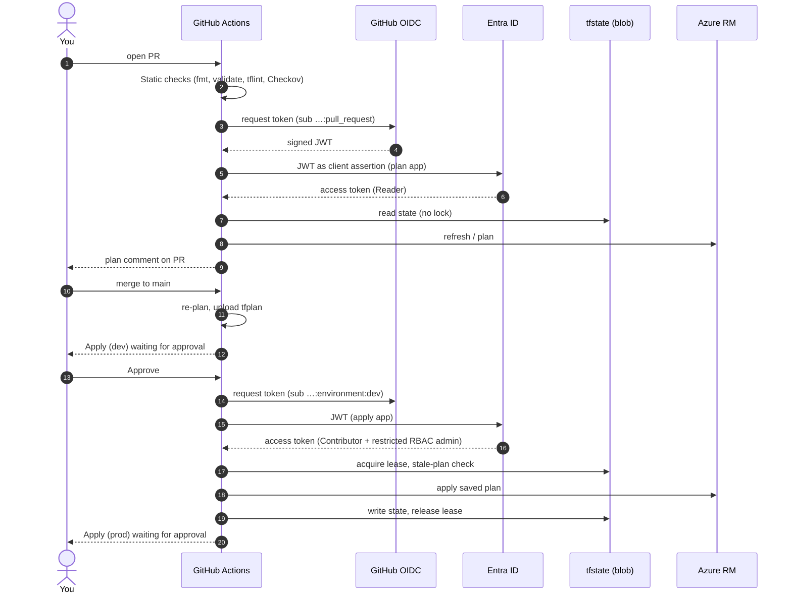

# Question 1: End-to-End Flow

This document follows everything that happens, in order, from an empty subscription to a finished `terraform apply`. It covers both ways to apply: **locally** (your laptop) and **through the pipeline** (GitHub Actions).

Each step says **what happens**, **why**, **what can fail**, and **where to change it**.

```
 PHASE 0  Prerequisites (once)
 PHASE 1  Bootstrap apply         laptop  → creates state backend, pipeline identities, GitHub settings
 PHASE 2  Infra plan/apply        laptop  → manual path (az login identity)
 PHASE 3  Pull request            GitHub  → checks + plan with the read-only identity
 PHASE 4  Merge → apply           GitHub  → approval gate → apply with the apply identity
 PHASE 5  Verify & tear down
```

---

## Phase 0: Prerequisites (once)

| # | What | Why |
|---|---|---|
| 0.1 | Install **HashiCorp Terraform** ≥ 1.9 (CI pins 1.16.5). Your current `terraform` command is OpenTofu. | The committed `.terraform.lock.hcl` files record `registry.terraform.io` providers. OpenTofu uses `registry.opentofu.org`, so the hashes would not match. |
| 0.2 | `az login` and `az account set --subscription "Azure for Students"` | The `azurerm`, `azuread` providers and the state backend all use your Azure CLI token locally. |
| 0.3 | `gh auth switch -u SaifRiaz3256` and `export GITHUB_TOKEN=$(gh auth token)` | The `github` provider in bootstrap reads `GITHUB_TOKEN`. It needs admin on the repo (to create environments and branch protection). |
| 0.4 | Push at least one commit to `main` | Branch protection is created for `main`, and the workflow files must be on the default branch for the pipeline to exist. The first workflow run will **fail**, because the Actions variables do not exist yet. That is expected. |
| 0.5 | Make the repo **public** (before relying on approvals) | On a free GitHub plan, environment protection rules and branch protection are only enforced on public repos. |

---

## Phase 1: Bootstrap (`Question_1/bootstrap`, local state)

```bash
cd Question_1/bootstrap
terraform init
terraform plan -out=bootstrap.tfplan
terraform apply bootstrap.tfplan
```

### 1.1 `terraform init`
1. Reads `versions.tf`: Terraform ≥ 1.9, providers `azurerm ~> 5.8`, `azuread ~> 3.10`, `github ~> 6.13`.
2. Downloads exactly the versions in `.terraform.lock.hcl` and verifies their checksums.
3. No `backend` block, so state is the **local** file `bootstrap/terraform.tfstate`. That is unavoidable: this config *creates* the remote backend (chicken-and-egg). The file is git-ignored.

### 1.2 `terraform plan`: authentication and data sources
1. **azurerm** and **azuread** get a token from your `az login` session.
2. **github** authenticates with `GITHUB_TOKEN` as owner `SaifRiaz3256`.
3. Data sources are read (read-only API calls):

| Data source | Returns | Used for |
|---|---|---|
| `azurerm_client_config.current` | your tenant ID and **your object ID** | app owners, your role on the state container, `AZURE_TENANT_ID` variable |
| `azurerm_subscription.current` | subscription ID | role assignment scope, `AZURE_SUBSCRIPTION_ID` variable |
| `github_repository.this` | `repo_id` = **1407727082**, `node_id` | immutable OIDC subject, branch protection |
| `github_user.owner` | `id` = **167188461** | immutable OIDC subject |
| `github_user.reviewers` | your numeric user ID | environment required reviewer |

4. Terraform builds the **immutable subject prefix**:
   ```
   repo:SaifRiaz3256@167188461/orzeh-assessment@1407727082
   ```
   GitHub has used this format for every repo created after 2026-07-15. This repo reports `use_immutable_subject: true`.
5. The plan shows **28 resources to add**.

### 1.3 `terraform apply`: what gets created, in dependency order
Terraform builds a dependency graph and creates up to 10 independent resources in parallel. The logical order:

**A. State backend (Azure)**

| # | Resource | Name | Settings and reasons |
|---|---|---|---|
| A1 | Resource group | `rg-orzeh-tfstate` (koreacentral) | Separate RG so state outlives any environment. |
| A2 | Storage account | `storzehtfstate3256` | GZRS (zone + geo redundant), **shared keys disabled** (Entra ID only), TLS 1.2, infra double encryption, blob **versioning** + 30-day soft delete (recover a corrupted state), public endpoint **enabled** because GitHub-hosted runners have no private path. `prevent_destroy = true`. |
| A3 | Container | `tfstate` | Created via ARM (`storage_account_id`), private. `prevent_destroy = true`. |
| A4 | Management lock | `lock-tfstate` (`CanNotDelete`) | Even an Owner must remove the lock before deleting the account. |
| A5 | Role assignment | **you** → *Storage Blob Data Contributor* on `tfstate` | Your laptop needs data-plane access to read and write state, because keys are disabled. |

**B. Pipeline identities (Entra ID)**

| # | Resource | Purpose |
|---|---|---|
| B1 | App registration + service principal `gh-orzeh-assessment-tf-plan` | Read-only identity for PRs and plans |
| B2 | Federated credentials on plan app (2) | `…@1407727082:pull_request` and `…@1407727082:ref:refs/heads/main` |
| B3 | App registration + service principal `gh-orzeh-assessment-tf-apply` | Identity that changes infrastructure |
| B4 | Federated credentials on apply app (2) | `…@1407727082:environment:dev` and `…@1407727082:environment:prod` |

Every federated credential has: issuer `https://token.actions.githubusercontent.com`, audience `api://AzureADTokenExchange`, and the **exact** subject. No client secret is ever created.

**C. Azure role assignments for the identities**

| # | Principal | Role | Scope | Why |
|---|---|---|---|---|
| C1 | plan | Reader | subscription | Refresh/plan reads every resource |
| C2 | plan | Storage Blob Data **Reader** | `tfstate` container | Read state; it never writes, so plans use `-lock=false` |
| C3 | apply | Contributor | subscription | Create the RG and all resources |
| C4 | apply | Role Based Access Control Administrator **+ ABAC condition** | subscription | Can only create/delete **Storage Blob Data Reader** assignments for service principals, which is exactly what `modules/identity` needs. It cannot grant itself Owner. |
| C5 | apply | Storage Blob Data Contributor | `tfstate` container | Write state and take the lock lease |

**D. GitHub configuration**

| # | Resource | Effect |
|---|---|---|
| D1 | Environments `dev`, `prod` | Required reviewer = you. `prevent_self_review = false` (single maintainer). Admins cannot bypass. |
| D2 | Deployment branch policy `main` on each env | A job targeting `dev`/`prod` from any other branch is rejected **before** it can get a token. |
| D3 | Repo variables `AZURE_TENANT_ID`, `AZURE_SUBSCRIPTION_ID`, `AZURE_CLIENT_ID_PLAN` | Not secrets (OIDC needs no secret), so they are stored as variables. |
| D4 | Environment variable `AZURE_CLIENT_ID_APPLY` (in `dev` and `prod`) | The apply client ID is only visible to jobs that **passed the approval gate**. |
| D5 | Branch protection on `main` | PR required (0 approvals: single maintainer), required checks `Static checks`, `Plan (dev)`, `Plan (prod)` must pass on an up-to-date branch, no force-push, no deletion. |

**Outputs:** state account name, plan and apply client IDs, the four trusted subjects.

**What can fail here**
- `403` creating app registrations → your account lacks *Application Developer* or higher (you are Global Admin, so this is fine).
- `RequestDisallowedByPolicy` → a region outside the allowed list (fixed to `koreacentral`).
- GitHub `404`/`403` → `GITHUB_TOKEN` belongs to a different account, or `main` does not exist yet.
- Storage account name taken → change `state_storage_account_name` **and** both `infra/env/*.backend.hcl`.

---

## Phase 2: Infra plan/apply locally (`Question_1/infra`)

```bash
cd Question_1/infra
terraform init -backend-config=env/dev.backend.hcl
terraform plan  -var-file=env/dev.tfvars -out=dev.tfplan
terraform apply dev.tfplan
```

### 2.1 `terraform init -backend-config=env/dev.backend.hcl`
1. `backend.tf` contains an **empty** `azurerm` backend; the `.hcl` file fills it in:
   `rg-orzeh-tfstate` / `storzehtfstate3256` / `tfstate` / key **`question1/dev.tfstate`** / `use_azuread_auth = true`.
2. The backend gets an Entra ID token (your `az login`) and lists blobs in `tfstate`. It needs the A5 role. **Wait 2–5 minutes after bootstrap** for role propagation, or you get `AuthorizationPermissionMismatch`.
3. No state exists yet, so Terraform starts empty.
4. Providers `azurerm 5.8.0` and `random 3.9.1` are installed from the lock file.
5. Switching to prod later: `terraform init -reconfigure -backend-config=env/prod.backend.hcl` gives a **different state file**, so dev and prod can never overwrite each other.

### 2.2 `terraform plan -var-file=env/dev.tfvars`
1. **Variables load**: defaults in `variables.tf`, then `dev.tfvars` overrides (LRS, 7-day retention, purge protection **off**, `10.10.0.0/16`). Validations run (env ∈ dev/prod, valid CIDRs, name formats).
2. **Provider setup** (`providers.tf`):
   - `resource_provider_registrations = "none"`: no attempt to register providers (the read-only CI identity could not).
   - `storage_use_azuread = true`: storage operations use Entra ID, because keys are disabled.
   - `features.storage.data_plane_available = false`: the provider never calls the blob endpoint, which is unreachable from outside the VNet once public access is off.
3. **Refresh**: on the first run there is nothing to refresh. Later runs read every resource from Azure to detect drift.
4. **Region precondition** on the resource group: `koreacentral` must be in `allowed_locations`. If not, the plan stops with a clear message instead of a policy-deny error mid-apply.
5. **Diff**: the plan shows **20 resources to add**. `-out=dev.tfplan` saves this exact plan.

### 2.3 `terraform apply dev.tfplan`: step by step
1. **Lock**: the backend takes a **blob lease** on `question1/dev.tfstate`. Anyone else running Terraform on dev now waits or fails with "state locked".
2. **Stale-plan check**: if state changed since the plan was made, apply refuses ("Saved plan is stale").
3. Resources are created in dependency order (parallel where independent):

```
random_string.suffix (e.g. "k3x9q")          ─┐
azurerm_resource_group  rg-orzeh-dev          ─┤
                                              ▼
module.network
  vnet-orzeh-dev 10.10.0.0/16
  ├─ snet-workload          10.10.1.0/24  (no default outbound internet)
  ├─ snet-private-endpoints 10.10.2.0/24  (PE network policies Enabled → NSG enforced)
  ├─ nsg-orzeh-dev-workload            (allow 443 out → PE subnet, deny Internet in)
  ├─ nsg-orzeh-dev-private-endpoints   (allow 443 from workload, deny everything else in)
  └─ 2 × subnet↔NSG associations
                                              ▼
module.private_dns
  ├─ privatelink.blob.core.windows.net   + VNet link (registration off)
  └─ privatelink.vaultcore.azure.net     + VNet link
                                              ▼
module.storage                              module.key_vault
  storzehdevk3x9q                            kv-orzeh-dev-k3x9q
  (public access Disabled, no keys,          (RBAC mode, public access off,
   TLS1.2, versioning, soft delete)           soft delete 7d, purge protection off)
  └─ container "appdata" (via ARM)            │
  └─ pe-…-blob in snet-private-endpoints      └─ pe-…-vault in snet-private-endpoints
       ├─ NIC gets e.g. 10.10.2.4                  ├─ NIC gets e.g. 10.10.2.5
       ├─ connection auto-approved                 ├─ connection auto-approved
       └─ DNS zone group writes A record:          └─ A record:
          storzehdevk3x9q → 10.10.2.4                 kv-orzeh-dev-k3x9q → 10.10.2.5
                                              ▼
module.identity
  id-orzeh-dev-blob-reader (user-assigned managed identity)
  └─ role assignment: Storage Blob Data Reader @ …/containers/appdata
```

4. After **each** resource is created, Terraform writes the updated state to the blob. A crash halfway leaves a correct partial state, and the next apply continues from it.
5. **Unlock**: the lease is released.
6. **Outputs** are printed: RG name, storage account name, private IPs, Key Vault URI, identity client ID.
7. **Duration**: about 4–7 minutes. Private endpoints and the Key Vault take the longest.

**What happens on Azure's side when a private endpoint is created**
1. Azure creates a NIC in `snet-private-endpoints` with a private IP.
2. The connection to the storage account or vault is **auto-approved**, because it is in the same subscription and the caller has approve rights.
3. The `private_dns_zone_group` writes an A record into the linked private zone.
4. Inside the VNet, `storzehdevk3x9q.blob.core.windows.net` → CNAME `…privatelink.blob.core.windows.net` → **10.10.2.4**.
5. From the internet the name still resolves, but the account **rejects** the request (public network access disabled).

**What can fail here**
- `AuthorizationPermissionMismatch` on init → role propagation; wait and retry.
- `StorageAccountAlreadyTaken` / vault name in use → extremely unlikely with the random suffix. Destroying and recreating gives a new suffix.
- `RequestDisallowedByPolicy` → region; see precondition.
- Running prod with `key_vault_purge_protection = true` → after destroy, the vault stays soft-deleted for 90 days (intentional).

---

## Phase 3: Pull request → checks and plan (GitHub Actions)

Trigger: a PR into `main` (any files, so the required checks always report).

### 3.1 Job `Static checks` (no Azure access)
1. Checkout (actions pinned to commit SHAs).
2. Install Terraform 1.16.5.
3. `terraform fmt -check -recursive`: fails on unformatted code.
4. `terraform init -backend=false` + `validate` for `infra` **and** `bootstrap`.
5. `tflint` with the azurerm ruleset (catches invalid SKUs and deprecated arguments).
6. **Checkov** security scan → results in the log and as SARIF in the repo's **Security** tab. Fails on any unskipped finding.

### 3.2 Jobs `Plan (dev)` and `Plan (prod)` (run in parallel after 3.1)
1. The job has `permissions: id-token: write`, so it may request an OIDC token.
2. **OIDC login**, step by step:
   1. The azurerm provider asks GitHub's token service for a JWT with audience `api://AzureADTokenExchange`.
   2. GitHub issues a token signed by `https://token.actions.githubusercontent.com` with
      `sub = repo:SaifRiaz3256@167188461/orzeh-assessment@1407727082:pull_request`.
   3. The provider sends that JWT to Entra ID as a *client assertion* for client ID `AZURE_CLIENT_ID_PLAN`.
   4. Entra ID checks issuer + **exact subject** + audience against the plan app's federated credentials → match (B2).
   5. Entra ID returns a short-lived access token for the **plan** service principal (Reader).
3. `terraform init -backend-config=env/<env>.backend.hcl`: reads state with Blob Data **Reader**.
4. `terraform plan -lock=false -var-file=env/<env>.tfvars -out=tfplan -detailed-exitcode`
   - `-lock=false` because the plan identity cannot write the lease. This is safe; see 4.3.
   - Exit code 2 = changes, 0 = no changes, 1 = error (fails the job).
5. The plan is written to the **job summary** and posted as a **sticky PR comment** (one per environment, updated in place on each push).
6. `tfplan` + `plan.txt` are uploaded as an artifact (5-day retention, since plans can contain sensitive values).

### 3.3 Merge rules
`main` is protected: the PR can only be merged when all three checks are green **and** the branch is up to date with `main`.

> A PR (even from someone malicious) can only ever get the **read-only** plan identity: the subject `…:pull_request` is trusted by the plan app only.

---

## Phase 4: Merge → approval → apply (GitHub Actions)

Trigger: push to `main` (the merge commit) touching `Question_1/**` or the workflow.

### 4.1 `Static checks` and `Plan (dev|prod)` run again
Same as Phase 3, but the OIDC subject is now `…@1407727082:ref:refs/heads/main` (trusted by the plan app, B2). The uploaded `tfplan-dev` / `tfplan-prod` artifacts are the plans that will be applied.

### 4.2 `Apply (dev)`: the approval gate
1. The job declares `environment: dev`. Before it starts, GitHub checks:
   - **Deployment branch policy**: is the ref `main`? Yes, continue. Otherwise the job is rejected.
   - **Required reviewers**: the run pauses as *Waiting*, and you get a notification.
2. You open the run, review the plan (summary or PR comment), and click **Approve and deploy**.
3. The job starts. Only now can it read `AZURE_CLIENT_ID_APPLY` (environment variable, D4).
4. Safety step: if the ref is not `refs/heads/main`, the job exits immediately.
5. **OIDC login** as in 3.2, but the token's subject is
   `repo:SaifRiaz3256@167188461/orzeh-assessment@1407727082:environment:dev`
   → matches the **apply** app's credential (B4) → token for the apply service principal.
6. Download artifact `tfplan-dev`: the **exact** plan created in 4.1.
7. `terraform init` (Blob Data Contributor on state).

### 4.3 `terraform apply tfplan`
1. Takes the **state lock** (blob lease), waiting up to 5 minutes (`-lock-timeout=5m`).
2. **Staleness check**: if anything changed state since the plan (another apply, a manual change written to state), Terraform aborts with "Saved plan is stale". Re-run the workflow to create a fresh plan. This is why planning without a lock is safe.
3. Executes exactly the reviewed changes (same order as Phase 2.3).
4. Writes state, releases the lock.

### 4.4 `Apply (prod)`
Starts only after `Apply (dev)` succeeds, then repeats 4.2–4.3 with the `prod` environment, its own approval, subject `…:environment:prod`, artifact `tfplan-prod` and state key `question1/prod.tfstate`.

### Concurrency
- Workflow-level group `q1-terraform-<ref>`: a second push to `main` queues behind the running one (never cancels an apply).
- Apply-level group `q1-terraform-apply-<env>`: only one apply per environment at a time.



---

## Phase 5: Verify and tear down

```bash
# Public access really off
az storage account show -n <account> --query "{public:publicNetworkAccess,sharedKey:allowSharedKeyAccess}"
az keyvault show -n <vault> --query properties.publicNetworkAccess
# Private A records exist
az network private-dns record-set a list -g rg-orzeh-dev -z privatelink.blob.core.windows.net -o table
# Identity can only read one container
az role assignment list --assignee <identity-principal-id> --all -o table

# Save evidence
terraform show -no-color dev.tfplan > ../evidence/dev-plan.txt

# Remove dev (state backend stays)
terraform destroy -var-file=env/dev.tfvars
```

The destroy runs in reverse dependency order: role assignment → identity → private endpoints (A records removed) → storage/vault → DNS links/zones → NSG associations → subnets/NSGs → VNet → RG.

---

## Where to change things

| You want to change… | Edit | Notes |
|---|---|---|
| Region | `infra/env/*.tfvars` `location`, `bootstrap/variables.tf` `location` | Must be in `allowed_locations` (subscription policy). |
| Address ranges | `infra/env/*.tfvars` | Dev and prod must not overlap if you ever peer them. |
| Storage redundancy / retention | `infra/env/*.tfvars` | Dev LRS/7d, prod GZRS/30d. |
| Key Vault purge protection | `infra/env/*.tfvars` | **Irreversible** once applied. |
| Container name | `modules/storage/variables.tf` `container_name` | Changes the identity's RBAC scope too. |
| NSG rules | `modules/network/main.tf` | Priority 100 allow, 4096 deny. |
| Identity's permission | `modules/identity/main.tf` | If you change the role, also update the ABAC condition in `bootstrap/identities.tf` (`blob_data_reader_role_id`), or apply will be denied. |
| State account name | `bootstrap/variables.tf` **and** `infra/env/*.backend.hcl` | Must match exactly. |
| Reviewers / environments | `bootstrap/variables.tf` (`deployment_reviewers`, `environments`) | Adding an env also needs `infra/env/<env>.tfvars` + `.backend.hcl` and a job in the workflow. |
| Required status checks | `bootstrap/variables.tf` `required_status_checks` | Must equal the job **names** in `q1-terraform.yml`. |
| Repo owner/name | `bootstrap/variables.tf` | OIDC subjects (with IDs) are rebuilt automatically from the GitHub API. |
| Terraform version in CI | `TF_VERSION` in `q1-terraform.yml` and `terraform_version` in `_q1-terraform-apply.yml` | Keep both in sync. |
| Checkov exceptions | inline `#checkov:skip=ID:reason` in the resource | Kept next to the code on purpose. |
